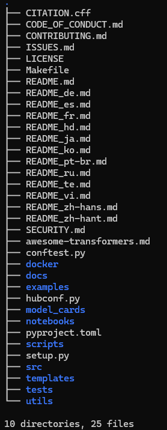

# 项目文件组织

```
├── CITATION.cff
├── CODE_OF_CONDUCT.md
├── CONTRIBUTING.md
├── ISSUES.md
├── LICENSE
├── Makefile
├── README.md
├── README_de.md
├── README_es.md
├── README_fr.md
├── README_hd.md
├── README_ja.md
├── README_ko.md
├── README_pt-br.md
├── README_ru.md
├── README_te.md
├── README_vi.md
├── README_zh-hans.md
├── README_zh-hant.md
├── SECURITY.md
├── awesome-transformers.md
├── conftest.py
├── docker : docker容器
├── docs ：文档
├── examples ：使用示例
├── hubconf.py
├── model_cards ：
├── notebooks ：
├── pyproject.toml
├── scripts ：脚本
├── setup.py
├── src ：源码
├── templates
├── tests
└── utils
```

```
├── CITATION.cff
├── CODE_OF_CONDUCT.md
├── CONTRIBUTING.md
├── docs
├── examples
├── hubconf.py
├── model_cards
├── notebooks
├── pyproject.toml
├── scripts
├── setup.py
├── src
├── templates
├── tests
└── utils
```